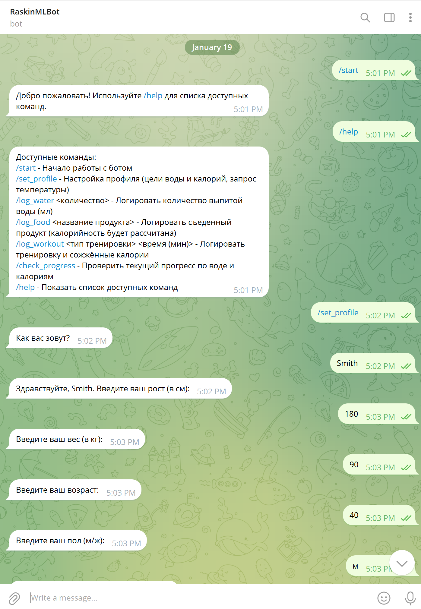

# HSE-AI-24-Python2-homework2-apavlovskii
HSE AI-24 Applied Python Homework 2 - Telegram BOT

Доступные команды:
/start - Начало работы с ботом
/set_profile - Настройка профиля (цели воды и калорий, запрос температуры)
/log_water <количество> - Логировать количество выпитой воды (мл)
/log_food <название продукта> - Логировать съеденный продукт (калорийность будет рассчитана)
/log_workout <тип тренировки> <время (мин)> - Логировать тренировку и сожжённые калории
/check_progress - Проверить текущий прогресс по воде и калориям
/help - Показать список доступных команд

Реализованная функциональность
- Ввод города в свободном формате, использование LLM для определения города из контекста
- Определение температуры в городе с использованием OpenWeatherMap API
- Определение калорийности продукта с исползованием API OpenAI
- Трекинг прогресса потребления воды и расхода калорий
- Рисование графиков прогресса по воде и калориям
- Хранение структуры данных пользователей в памяти

